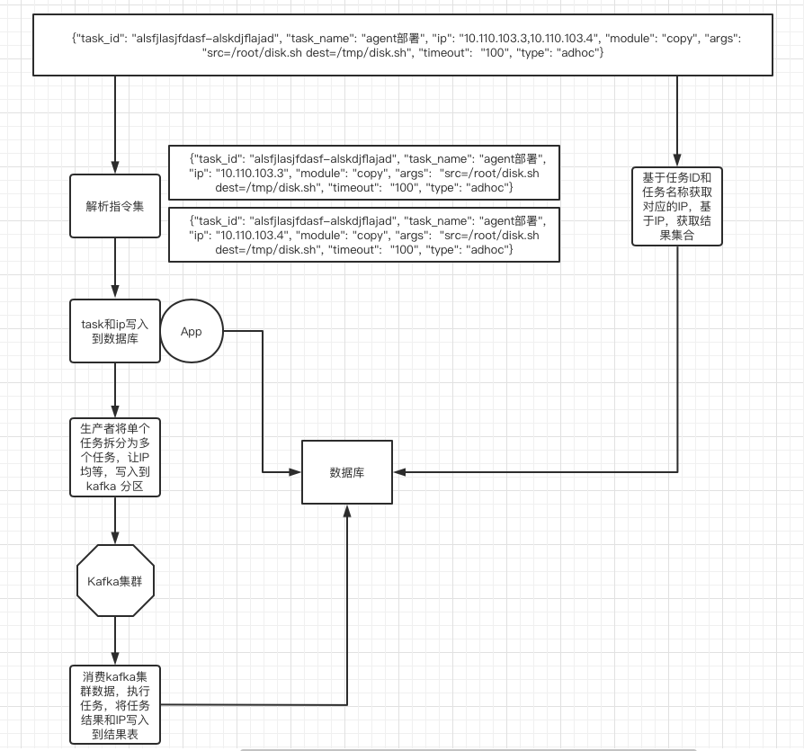
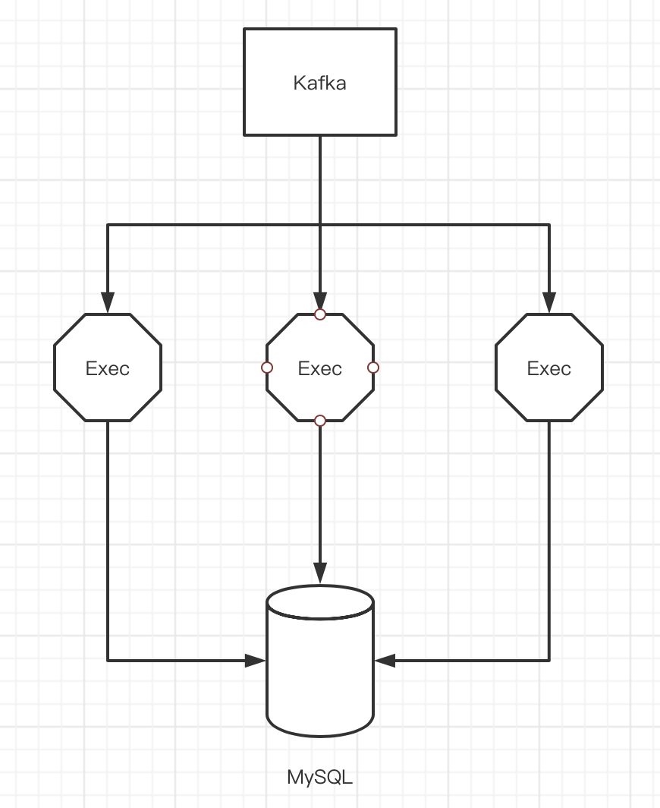

### Fil-Distribute任务分发


#### 一：软件介绍

> `(一) 功能`

- fil-distribute主要工作是完成ansible任务拆分，将拆分后的任务推送到Kafka消息队列中，并且基于task_id、ips、ip获取任务的执行进度和执行结果。

- fil-execute-engine主要工作是完成Kafka指令集消费，执行指令集任务，将任务结果写入到MySQL数据库中。


> `(二) fil-distribute基本思想`




> `(三) fil-execute-engine基本思想`




#### 二：部署安装

> `(一) 克隆项目`

```
git clone git@gitee.com:ipfsmain/fil-distribute.git
```

> `(二) 项目部署`

- 部署(确保主机上已经安装了docker环境)

```
# 1：切换到项目目录
cd fil-distribute

# 2：修改配置文件
vi conf/server.conf

# 3：修改私钥，用于从git上来取代码
vi  id_rsa
```

- 查看运行情况

```
docker ps | grep distribute
2e753f8f672b   fil-distribute:1609728655   "bash /app/fil-distr…"   4 hours ago   Up 4 hours   0.0.0.0:8007->8007/tcp                                 fil-distribute
```
