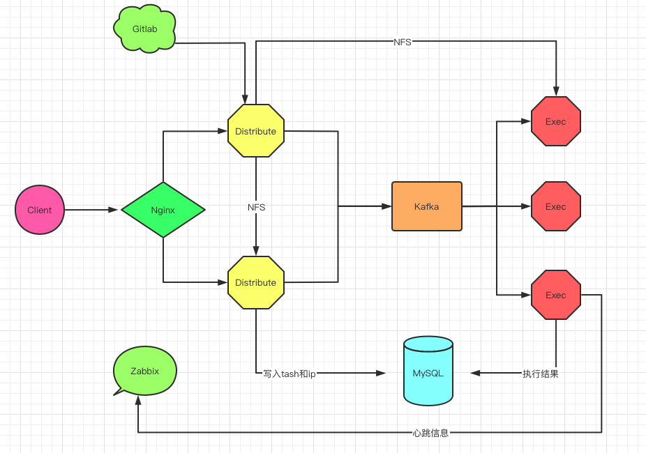

### Distribute任务分发和Execute-Engine任务执行


#### 一：项目介绍

> `(一) 功能`

- `Distribute`主要工作是完成ansible任务拆分，将拆分后的任务推送到Kafka消息队列中，并且基于task_id、ips、ip获取任务的执行进度和执行结果

- `Execute-Engine`主要工作是完成Kafka指令集消费，执行指令集任务，将任务结果写入到MySQL数据库中


> `(二) Distribute和Execute-Engine数据交互方式`



- 在上图中，Distribute服务为两个docker容器，目的是确保服务的高可用性。在其中一个Distribute服务中，安装了NFS，基于轻量级NFS网络文件系统，将从Gitlab上拉取的项目文件(需要配置公钥，避免输入用户名和密码)，共享给另外一个Distribute容器，同时也共享给所有的Execute-Engine执行引擎，执行引擎可以执行远程的copy任务

- 客户端发送请求有三种：`第一种是项目克隆的请求`。因为在项目部署或更新应用程序配置的时候，一般会从Gitlab上拉取满足发布要求的项目版本，或配置文件，将这些文本文件或二进制文件拉取到Distribute上

- `第二种请求是任务下发请求`，当一个任务下发以后，Distribute会基于ips字段判断需要执行任务的ip数，默认情况下，Distribute会以30个ip作为一个子单元，进而将用户下发的任务切割成若干个子任务，并且将这些子任务推送到Kafka指定的Topic中，等待已经订阅此Topic的Execute-Engine执行引擎来消费其中的Message

- `第三种请求是任务执行结果查询请求`，当任务下发完毕后，用户就可以基于任务ID或IP查询任务执行的结果。例如在Adhoc任务中，用户可以基于task_id、ips、或ip来查询单个IP或多个IP执行的结果。在Playbook任务中用户可以基于ips来获取一个Playbook执行的成功率以及最终结果

- `Execute-Engine执行引擎`从Kafka中消费的Message有两类，一类是Adhoc，另一类是Playbook，Execute-Engine是一个Daemon守护进程，一旦程序启动后，会开启两个子进程，一个进程主要是消费Kafka中Message，另外一个是向Zabbix的Server端或Proxy端发送TCP心跳包

> `(三) 优势对比`

- **1：对比传统Ansible执行命令和Jenkins中执行Ansible脚本，Distribute和Execute-Engine组合给用户带来的便利有如下几个方面**

	- ①：当Ansible在上千台或上万台主机上执行任务的时候，经常由于其中的一台或几台系统盘IO故障，无结果返回而卡死，或者Ansible子进程中线程池无法获取线程对象执行的返回结果而进入死循环，并且无法知道是其中哪些主机出问题，从而浪费大量的故障排查时间

	- ②：在Jenkins页面中，当执行一个Job任务，Job任务中调用Ansible插件，如果被执行任务的主机数量众多，Jenkins执行日志页面也会由于Ansible任务的卡死而陷入到无限等待中，导致其他的Jenkins任务无法执行


- **2：为了解决上述问题，`Distribute和Execute-Engine`从两个方面对Ansible任务的执行进行了优化：**

	- ①：引入任务Unit子单元，在Distribute中将成千上万的IP切割为多个小任务，避免了大批量主机执行任务卡死的情况

	- ②：给每个任务添加超时时间，在规定的超时时间内，没有任务结果返回，程序将会立马终止任务，任务执行结果会记录到数据库中，从而可以非常方便的找出是哪些主机有问题，无法顺利执行任务

	- ③：执行引擎的执行能力会由Execute-Engine部署的数量线性提高


#### 二：部署

- Distribute可以部署一台，也可以部署多台，多台Distribute目的是提高Distribute的可用性

> `(一) Ubuntu部署一台Distribute(目前项目只适合在Ubuntu上部署，后续将支持在Centos上部署)`

- 创建项目目录

```
mkdir /app
```

- 拉取项目

```
cd /app
git clone https://github.com/yinhuanyi/distribute.git
cd distribute
```

- 修改 conf/server.conf 配置文件

```
# Kafka集群
[Kafka_Cluster]
BOOTSTRAP_SERVERS = KAFKA_IP:KAFKA_PORT
GROUP_ID = adhoc
AUTO_OFFSET_RESET = latest
# Kafka创建的topic名称，与distribute中的TOPIC_NAME一致
TOPIC = TOPIC_NAME

# Execute-engine和Distribute数据库是同一个数据库
[MySQL]
# MySQL地址
IP = MySQL_IP
# MySQL端口
PORT = 3306
# 数据库名称
DATABASE = execute_engine
# 数据库用户
USER = root
(加密后的密码：加密使用execute-engine/utils/encrypt_decrypt.py脚本对密码进行加密和解密)
PASSWORD = MySQL_PASSWORD

[Exec_Engine]
# ip列表切割单元
NUMBER = 30

[Gitlab]
# Gitlab IP地址
IP = Gitlab_IP
# 需要部署的应用程序或配置文件所在的Gitlab组，如果没有，保留空即可
GROUP = ci-cd
```

- 填写服务器上id_rsa私钥内容

- 构建docker镜像，并运行容器，默认端口是8007，如需修改现有修改entrypoint.sh、deployment.sh和distribute.dockerfile脚本的端口

```
cd /app/distribute
bash deployment.sh
```

- 查看容器

```
docker ps 
```